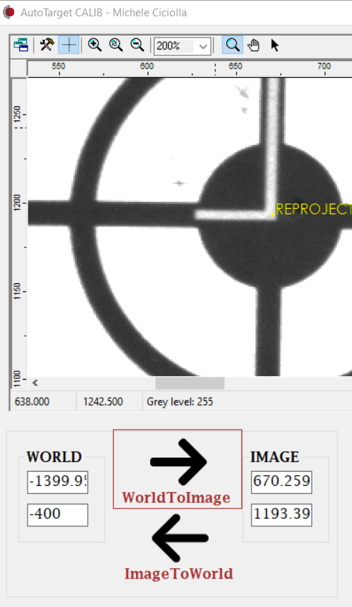

# An Approach to Camera Calibration in Industrial Robotics Using HexSight

This Master Thesis project is developed with the support of the Star s.r.l company in Latina (RM) which gave me the opportunity to deal with real machine vision problems in industrial robotics scenario. The machine vision software which i'm developing my project with is LMI HexSight, a powerful VB.NET library.

## Aim of this project
The goal of this thesis was to automatize the process of calibrating cameras in the industrial robotics context. In particular for this project an ABB IRB4600 robot, a Allied-MAKO camera are used.
The task of the robot is to move the tool in several positions while the acquisition process carried by the HexSight software is to save the pixel coordinates of the target mounted on the robot.

  
  

## The visual basic HMI

  

This HMI developed using VB.NET permits to the user to control the whole process. A native HexSight display shows the camera view and coordinates acquisition. The buttons are used to interact with the process, i.e to start a new calibration or test one. Accuracy results are shown aswell in the dashboard in the upper-right.

## Results

  

The application has been tested on the Image-To-World estimation, that is the accuracy in estimating a 3D position of a point based on its 2D pixel image. Both the maximum and average estimation errors encountered are reported in the upper plot.

The application demonstrated to perform well, in particular those points near the center (distance < 275mm) are estimated with a sub-milimetric accuracy of 0.2982 mm in the average case.

  
  

## Documentation

You can read the final technical presentation about this project here [report](./presentation.pdf).

